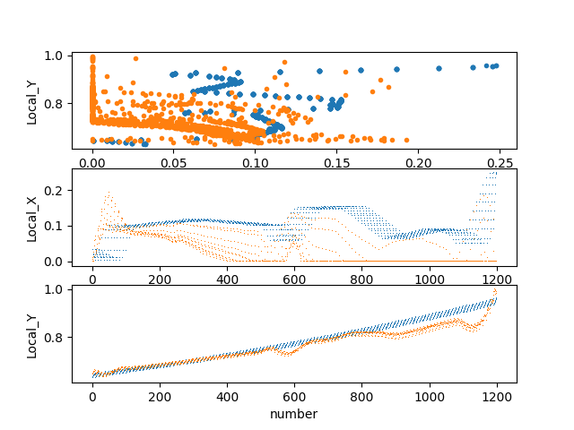

LSTM_Trajectory_Prediction
--
## 项目介绍  
[README_EN](./README_en.md)  

本文使用LSTM预测无人驾驶车辆的路径, **通过前10步预测后10步**     
输入：t-10~t-1时刻路径    
输出：t~t+9时刻路径    
路径为二维数据(Local_X, Local_Y)  


## 数据  
数据集来源于NGSIM     
LSTM输入(seq, step, dim)  
seq:训练集的序列，归一化到0-1  
step：每次输入是10步，根据前10步预测后10步  
dim：数据维度是2, (X,Y)  
### 训练集
从NGSIM取了400个数据作为本次实验的数据  
训练集数量：400*0.7 = 280  
测试集数量：400-280 = 120  

## 训练模型  
```  
python train.py  
```

## 预测轨迹
```
python predict.py
```

## 效果    
蓝色为前10步,橙色为后10步    

example1:     
   
  
example2:    
.png)  


## 参考资料  
[LSTM多维多步训练](https://blog.csdn.net/qq_35649669/article/details/89575949)  

## TIPs  
本项目只是用了很少一段数据，应该对数据集进行特征提取，并且采用更多数据进行训练。  
